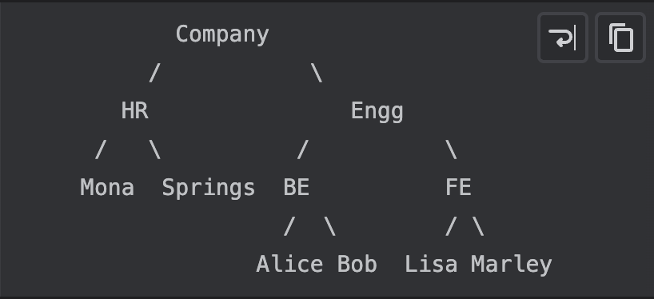
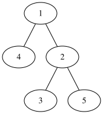

## Concept-wise

### Array based

#### Given an array of integers find the subarrays with sum K

Refer https://www.geeksforgeeks.org/find-subarray-with-given-sum-in-array-of-integers/ or https://www.geeksforgeeks.org/number-subarrays-sum-exactly-equal-k/ they are about the same problem.

##### Brute force

Generate all the subarrays, calculate sum and check. [N-choose-2 possibile subarrays](/content/notes/combinations-and-nested-for-loops.md) will be there.

##### Better approach

While traversing the array, track the current sum, store the sum of array ending at each index in a hash map (sum and index mapping). Check if the K-currsum exists in the hashmap.

#### Number of substrings having an equal number of lowercase and uppercase letters

Refer Number of substrings having an equal number of lowercase and uppercase letters
It can be reduced to the above subarrays with sum K, where K=0 and each upper case letter is considered 1 and lower case letter is considered -1.
Reference: https://www.geeksforgeeks.org/number-of-substrings-having-an-equal-number-of-lowercase-and-uppercase-letters/

### Fast and slow pointers

- Classify the number in an array: Move all the odd numbers to beginnig of the array/linked list
- Remove zeros from the array/linked list
- Remove duplicate numbers from the array/lined list
- [Move Zeros to the end](https://www.pramp.com/challenge/9PNnW3nbyZHlovqAvxXW)
- Check if loop exists in the given linked list

### Sliding window

- (Check if these fall into same category). Understand [the pattern](https://nan-archive.vercel.app/sliding-window) and solve [some problems](https://www.geeksforgeeks.org/number-substrings-count-character-k/ )
- [Max product subarray](https://www.geeksforgeeks.org/maximum-product-subarray/#expected-approach-by-using-kadanes-algorithm-on-time-and-o1-space)

### Two pointers

- Given an array of integers find two elements who sum is K. (2-sum or 3-sum problem)
- [Greatest difference between two elements, such that the larger element appears after the smaller element](https://www.geeksforgeeks.org/maximum-difference-between-two-elements/)
  - The intuitive solution can be, while traversing the array, keep track of the minimum element so far, find the difference between minimum element sofar and current element, if the difference is greater than the difference seen sofar, update it. Refer [Apple online assessment](https://leetcode.com/discuss/interview-question/1044971/apple-online-assessment-2-questions)

### Misc

- [Apple online assessment](https://leetcode.com/discuss/interview-question/4482769/Apple-India-or-Software-Engineer-or-December-2023-or-Online-Assessment/)
  - [Minimize Deviation in Array](https://www.geeksforgeeks.org/minimize-deviation-of-an-array-by-given-operations/)

- [Fenwick/BIT Tree](https://www.enjoyalgorithms.com/blog/binary-indexed-tree) learn concept/pattern behind this.

### Dynamic Programming

Important points:
Break down the problem, write a recurrence that solves the problem. There are two approaches:

- Memoization/top-down
- Bottom-up/tabulation
Start from the smallest subproblems, solve them, save their solutions for reference. Each problem depends on the solution of smaller problems that are already solved. In this approach, we might solve the subproblems which may not be used later.
- [Fibonacci numbers problem by basecs](https://medium.com/basecs/less-repetition-more-dynamic-programming-43d29830a630)
- [0/1 Knapsack problem solution by striver](https://www.youtube.com/watch?v=GqOmJHQZivw)
- [Deletion Distance](https://www.pramp.com/challenge/61ojWAjLJbhob2nP2q1O)
- https://www.geeksforgeeks.org/largest-sum-contiguous-subarray/
- [The size of the longest incresing subsequence in an array](https://cp-algorithms.com/sequences/longest_increasing_subsequence.html)
  - The link attached has intuitive solution.
  - [longest increasing subsequnces](https://www.geeksforgeeks.org/longest-increasing-subsequence-dp-3/)

### Practiced problems
- [Maximum square in a grid](https://raw.githubusercontent.com/nsaikiran/MyPrograms/refs/heads/master/Python/interview-prep/dp-questions/maximum-square.py)

## Problems to practice

- Classify elements in the array. Given an array classify the numbers as even, odd. Put all even numbers to the start of the array and odd numbers to the end. EPI arrays
- Find sum of most K recent numbers of a stream
Given a stream and when asked about most recent numbers, circular queue can be used know the implementation. Like moving sum or average etc
- Range sum problem
Given a array of numbers, implement some queries. Like rank of a given number, least number greater than some K, or greatest number less than K etc. Sort the array and do some preprocessing that will same somtime. This is on a static array, if that is a stream then we need to use someother approaches.
- Quick sort and merge sort code. Review once and write. How the merge step and pivot selection and placing it in right spot helps.
- H-Index problem: https://leetcode.com/problems/h-index/description/
- LRU cache implementation - ADT
  - Common implementation is using HashMap to store key-value pair for easy mapping and a doubly linked list of keys to maintain the "least recent used" order so that eviction is easy.
  - [We can also use signly linked list in place of doubly linked list, but implementaion will be not that intuitive as above](https://stackoverflow.com/questions/49621983/lru-cache-with-a-singly-linked-list)
- [LFU cache implementation - ADT](https://arpitbhayani.me/blogs/lfu/)
- Application of Ordered Set and its implementation. Python has OrderedDict,deque. Differences and their benefits.
- [Find immediante next greater element for each element in an array](https://github.com/nsaikiran/MyPrograms/blob/master/Python/interview-prep/nge.py): Example of using stack datastructure
- Problems from https://github.com/Chanda-Abdul/Several-Coding-Patterns-for-Solving-Data-Structures-and-Algorithms-Problems-during-Interviews
  - all sections atleast 2 questions or 2 model of questions

### Queries on a stream of data

- [Find running median from a stream of integers](https://stackoverflow.com/questions/10657503/find-running-median-from-a-stream-of-integers). [Leetcode](https://leetcode.com/problems/find-median-from-data-stream/description/)
- [Sum of most recent K numbers of a stream of integers]() TODO.
- [Median of most reent K number os a stream of integers]() TODO.
- [Hit Counter that counts the number of hits within recent time](https://leetcode.ca/2016-11-26-362-Design-Hit-Counter/)

## Previous questions and learnings

### G Attempt 1

- Given a set of cartesian points, generate the bounding box that includes all the points.
- Given two strings, and we can cut the strings at same position. After cut we take the left half of the first string and right part of the second string and join them to form a new string. How many of those new strings are plindromes - https://cs.stackexchange.com/questions/109662/divide-two-strings-to-form-palindrome 
- Given a string with limited number of characters repeating. Find the number of substrings where the count of all allowed characters is same in the substring.
  - Ex: RBRRB 
  - [Program to generate all such substrings](https://github.com/nsaikiran/MyPrograms/blob/master/Python/interview-prep/substrings-with-all-unique-chars-and-same-freq.py)
- General json validation: string processing. Should have covered all of the edge cases. And validated the approached up front. So that I was confident while coding.
- Given start binary pattern and destination binary pattern, see if we can reach from start pattern to end, in each step only one bit can be flipped. Also given a set of safe states through which you should be traversing. Moving to a non-safe pattern in invalid. https://leetcode.com/discuss/interview-experience/515564/google-l3-hyderabad-feb-2020-rejected lock round 5
- Given a dictionary of words, suggest the user words based first few characters typed, like the functionality in mobile phone typing scenario.

### G Attempt 2

- A robot is emitting stream of messages, the format of the messages is: MSG TIMESTAMP. Our goal is to only log the events that are not repeated within K(for ex:10) units of time.
Robot is emitting messages - time - message.
  - Solution: A simple hashing solution where, we store the message and its last seen timestamp in hash map, next time if the same message is seen, we will check the diff of timestamps. If it is less than K(for ex:10) then we show it.
- Searialize standard python objects into JSON.
  - Seemed simple but they were looking at the way I'm handling the edge cases. Need to finish fast so that we could do a followup. Follow up question was [how to solve if the objects are recursive.](/content/notes/python-objs-recursive)
- Bigram model
  - 
  - 
  - The question was easy, I was supposed to finish this quickly so that a little difficult followup could be asked.
  - Also, during interview I wanted to get the pair with maximum value, from hashmap quickly, but I couldn't get effective one other than O(n). Check the above code I wrote, I could have use collections.Counter in place of dict and may be could have use *most_common* method, but time complexity wise no better than linear. Because *most_common* takes *lower bounds of sorting* amount of time, i.e, O(nlogn) when argument isn't specified. And, they used heap data structure when argument is specificed, this is like creating heap and performing *n* pops.
  - Learning: Be confident, no self-doubt.
  - We wanted [a sorted set kind of thing.](https://jothipn.github.io/2023/04/07/redis-sorted-set.html)

### G Attempt 3

- Given a directed graph we need to find the longest outgoing path from each node.
  - I took time because I was already sleepy at 10.15 PM. And I've missed one case, I needed to keep 1 + max( longest_path_from_each_childre). But I've kept wrong. Realized at the end of interview but didn't convey as times up.
    - 

- 
  - 
    Again a simple DFS based question I think, cross check this problem and clearly learn to solve.

### Aple-attempt1

- Hacker rank test questions
  - 
  - 
Q1 seems similar to [House Robber Leetcode](https://leetcode.com/problems/house-robber/description/) [GFG](https://www.geeksforgeeks.org/find-maximum-possible-stolen-value-houses/) check and do the problem. House robber problem is disguised as [*maximum sum of non adjacent elements*](https://leetcode.com/discuss/interview-question/702177/apple-phone-maximum-sum-of-non-adjacent-elements). Also, Q2 is same as [maximum sum of non adjacent elements in a circular array](https://www.geeksforgeeks.org/maximum-sum-in-circular-array-such-that-no-two-elements-are-adjacent/).

Striver has 1D DP and 2D DP practice and get a clear understanding of that. I've seen those videos but practice once again.

### Shaw-attempt1

- Hacker rank test questions
  - 
  - 

Got [solution from chatgpt for Q1](https://chatgpt.com/share/682b78a3-e08c-800b-9701-5b406443f23d). 
Q2 must be similar to [this question](https://www.geeksforgeeks.org/minimum-number-of-leaves-required-to-be-removed-from-a-tree-to-satisfy-the-given-condition/)

### Jira company

#### Code design round

[This question](https://raw.githubusercontent.com/nsaikiran/MyPrograms/refs/heads/master/Python/interview-prep/agents-with-their-rating-sorted.py) is asked, this round is essentially code design round so it must be low level design round.

I wanted to have a data structure that does the update of average value of rating and also prepopulate the sorted list or keep on updating the sorted list. I think, [the implementation of skiplist based sorted list/sorted set](https://jothipn.github.io/2023/04/07/redis-sorted-set.html) is optimal, but check once if that fits. But I did the basic solution. However keep in mind that these problems where we wanted to have similar solution maybe used.

#### Data structure round

Input Target employees - Lisa, Marley
Output: FE

Input Target employees - Alice, Marley
Output: Engg

Input Target employees - Mona, Lisa, Bob
Output

Imagine you are the team that maintains the Atlassian employee directory. 
At Atlassian - there are multiple groups, and each can have one or more groups. Every employee is part of a group.
You are tasked with designing a system that could find the closest common parent group  given a target set of employees in the organization.

I gave a [solution](https://raw.githubusercontent.com/nsaikiran/MyPrograms/refs/heads/master/Python/interview-prep/least-cmmon-ancestor.py), and couldn't finish the code, almost done. Review this.

### Pypl

*Didn't finish this question*
Maximize the sum of k numbers to be picked from an array of size n.
[Maximize sum of K corner elements in Array](https://www.geeksforgeeks.org/maximize-sum-of-k-elements-in-array-by-taking-only-corner-elements/)
Rules
k  <= n
Numbers can be picked for summation only from the ends. This means that element 0 should be picked before element 1 and so on from left side. Similarly from right side, element n-1 should be picked before element n-2 and so on.
Although we can pick only end elements for summation, we are free to look at all the elements in the array.
Example, if there is an array like 3,5,1,1,1,1,8. The maximum sum when k = 3 is 16. (3 + 5 + 8)

Refer [my solution](https://raw.githubusercontent.com/nsaikiran/MyPrograms/refs/heads/master/Python/interview-prep/corner-elemenets.py)

### MS

*Given a tree  with n (n nodes and n-1 edges), find the nodes that are not on any longest path from any two nodes.*

- 
- [!Ex2](images/ms-1/ex2.svg)
For ex1, there is no such node, because all nodes are on one of the longest path. (Thre exists several longest paths with same length)
For ex2, thre is on node, i.e, 4.

Refer [Solution](https://raw.githubusercontent.com/nsaikiran/MyPrograms/refs/heads/master/Python/interview-prep/tree-ms.py)

* Given an array of numbers, find the number of subarrays such that, the bitwise OR of all elements of subarray exists in subarray *

Refer [solution](https://raw.githubusercontent.com/nsaikiran/MyPrograms/refs/heads/master/Python/interview-prep/substrings-with-all-unique-chars-and-same-freq.py) Ask chatgpt if questions is there.

## Mock questions

- [Substrings where each vowel occurs atleast once and all vowels must present](https://raw.githubusercontent.com/nsaikiran/MyPrograms/refs/heads/master/Python/interview-prep/substrings-with-vowels.py) - sliding window - variable length

## Practiced problems

- https://www.geeksforgeeks.org/move-zeroes-end-array/
- [Building bridges](https://www.geeksforgeeks.org/dynamic-programming-building-bridges/) [This is similar to longest increasing subsequences problem.](https://www.youtube.com/watch?v=MoJy1QV5LXA). - DP
- [Maximum product subarray](https://www.geeksforgeeks.org/maximum-product-subarray/) - DP

TODO: 

- Q2 of de-shaw, 
- leader board problem using skiplist, with proper ADT diagram and understanding.
- neetcode list to cover all concepts not only spending too much time on only one concept.